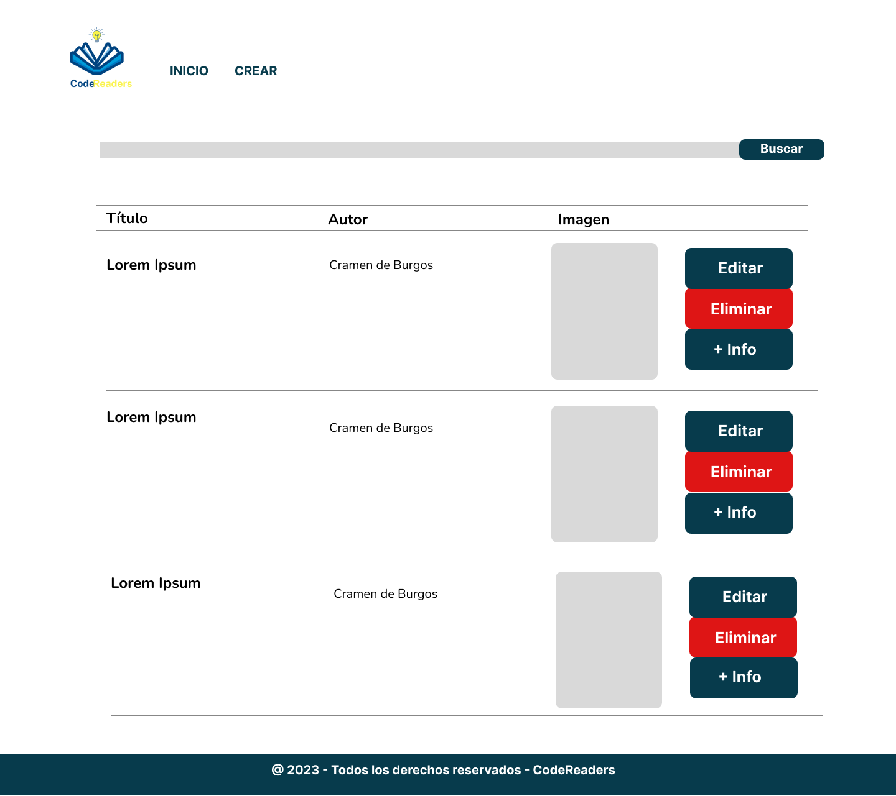
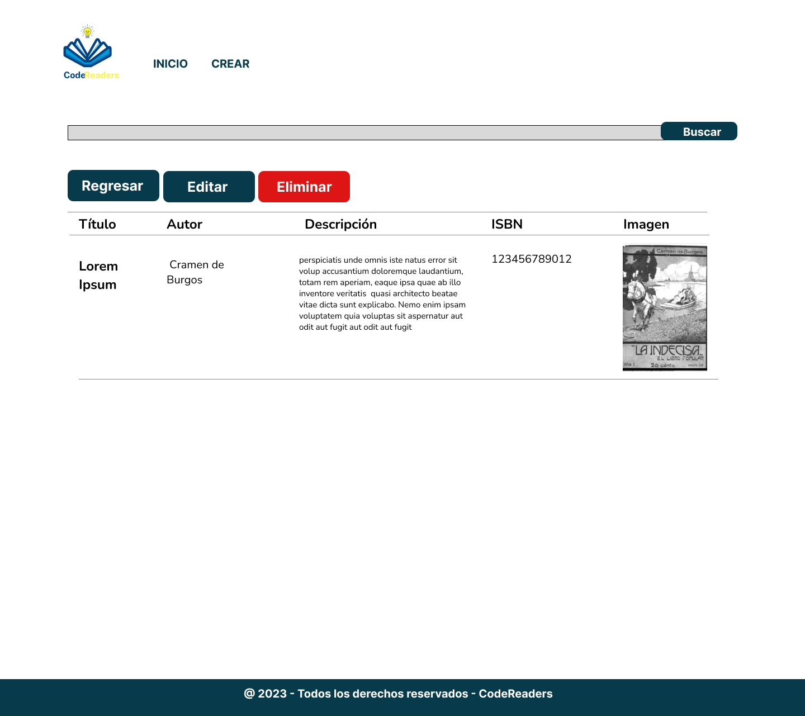

_____________________
# 
 📚 Biblioteca 📚

  

   
   

## Contexto:

La biblioteca de nuestro barrio se quiere modernizar y necesita tener todos sus libros organizados en un programa web, tener un inventario actualizado le facilitará la gestión, para poder prestar mejor sus servicios, la administradora de la biblioteca necesita añadir libros, actualizarlos y poder borrarlos. También quiere que se visualicen en la primera página.

## Descripción
Primera página

Es la página de inicio del Sitio Web, cuenta con un diseño minimalista en el que se ve el logo de una biblioteca. Lo principal de este sitio es que cuenta con dos enlaces (Inicio y Crear) donde los usuarios pueden utilizar para navegar.ç

Además en esta página se encuentra la vista de los 15 libros extraídos de MySQL y en cada libro se renderiza un botón para editar, uno para eliminar y otro +Info que redirige a una segunda página. El boton de eliminar elimina un registro y el de editar permite cambiar atributos de un libro. Asimismo el enlace de crear genera un formulario que permite crear un nuevo registro de libro.

Segunda Página

Esta sección muestra los diferentes atributos: título, autor, descripción, ISBN, foto. Asimismo hay tres botones: regresar, editar y eliminar.

Nota:
Es importante mencionar que tanto la cabecera como el pie de documento de cada una de las páginas incorporan el mismo contenido.
## Mockups
#### Desktop

#### Movil

## Tecnologías

## Herramientas

 

## Equipo

        Neema Nelly- Product Owner y Developer (bneemanelly@gmail.com)
        Leandra Bujhamer- Scrum Master y Developer (lea.bujh@gmail.com)
        Ana Lucía Silva Córdoba- Developer (coderalsc@gmail.com)
        Rosa Rubio - Developer (rosamrubio@gmail.com)
        Rosmary Medina- Developer (rousmedina21@gmail.com)

____________________________

